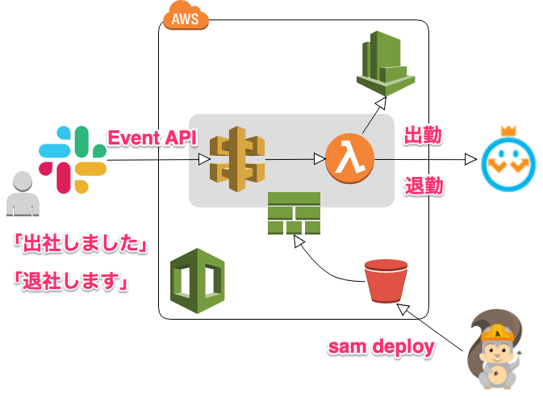
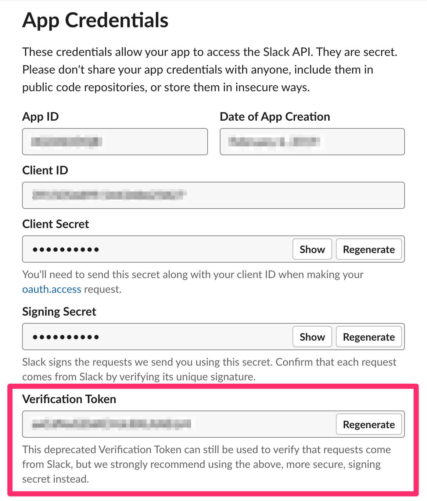
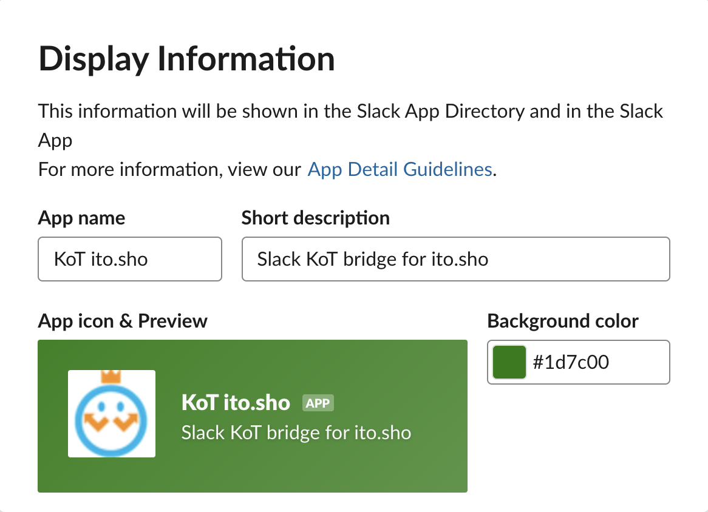
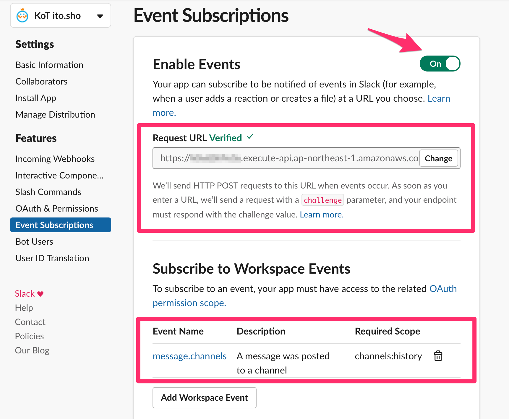

# Slack KoT Bridge

Slackチャンネル上の「出社」「退社」メッセージをトリガーに、Myレコーダー | KING OF TIME上で出勤、退勤するSlack Appです。  
Myレコーダーの出勤処理、退勤処理を実行するために、セッティングするSlack Appは個々人用に必要になります。  



## 構築
### Slack App設定
1. Slackで[Create New App](https://api.slack.com/apps?new_app=1)します。
2. アプリケーションのBasic Informationを開き、Verification Tokenをコピーします。
  
3. `AWS SAMデプロイ` に記載の手順で、Slack Appをデプロイします。この際、 `SLACK_VERIFICATION_TOKEN` には `2.` で取得したトークンを設定します。
3. Display Informationを開き、名前や説明を入力します。
  
4. 出退勤のSlackメッセージを監視できるようにEvent Subscriptionsを開きEnable EventsをOnにします。
  
5. `Request URL` にAPI Gatewayのエンドポイントを入力します。(e.g. https://example123.execute-api.ap-northeast-1.amazonaws.com/Prod/webhook)
6. `Subscribe to Workspace Events` で `Add Workspace Event` から `message.channels` を追加します。
7. Install Appを開き、ワークスペースにインストールします。

一般向けの公開Slack Appではないため **※ Manage Distribution** で公開はしません。

### AWS SAMデプロイ

```sh
aws s3 mb s3://${BUCKET_NAME}

sam package \
    --profile ${AWS_PROFILE} \
    --template-file template.yaml \
    --output-template-file packaged.yaml \
    --s3-bucket ${BUCKET_NAME}

sam deploy \
    --profile ${AWS_PROFILE} \
    --template-file packaged.yaml \
    --stack-name ${MODULE_NAME} \
    --capabilities CAPABILITY_NAMED_IAM \
    --parameter-overrides \
        BucketName=${BUCKET_NAME} \
        SlackVerificationToken=${SLACK_VERIFICATION_TOKEN} \
        KotClockInText=${KOT_CLOCK_IN_TEXT} \
        KotClockOutText=${KOT_CLOCK_OUT_TEXT} \
        SlackUserId=${SLACK_USER_ID} \
        KotRecorderGatewayUrl=${KOT_RECORDER_GATEWAY_URL} \
        KotUserId=${KOT_USER_ID} \
        KotPassword=${KOT_USER_PASSWORD} \
        SlackWatchingChannelId=${SLACK_WATCHING_CHANNEL_ID} \
        SlackReportingWebhook=${SLACK_REPORTING_WEBHOOK}
```

#### 変数
| 変数名                    | 説明                                                                               |
|---------------------------|------------------------------------------------------------------------------------|
| BUCKET_NAME               | デプロイ用のS3バケット                                                             |
| SLACK_VERIFICATION_TOKEN  | Slack Appの[Verification token](https://api.slack.com/events-api#url_verification) |
| KOT_CLOCK_IN_TEXT         | Myレコーダーの出勤処理トリガとなるSlackメッセージキーワード(e.g. 出社, 開店)       |
| KOT_CLOCK_OUT_TEXT        | Myレコーダーの退勤処理トリガとなるSlackメッセージキーワード(e.g. 退社, 閉店)       |
| SLACK_WATCHING_CHANNEL_ID | 出社、退社などの宣言をするSlackチャンネルのID(e.g. CXXX8E000)                      |
| SLACK_USER_ID             | 自身のSlackユーザーID(e.g. UXXXXX00A)                                              |
| KOT_RECORDER_GATEWAY_URL  | MyレコーダーのAPIエンドポイント(e.g. https://s2.kingtime.jp/gateway/bprgateway)    |
| KOT_USER_ID               | 自身のKING OF TIMEのユーザーID                                                     |
| KOT_USER_PASSWORD         | 自身のKING OF TIMEのパスワード                                                     |
| SLACK_REPORTING_WEBHOOK   | 出勤、退勤処理結果レポート用のSlack Incoming Webhook URL(未使用)                           |

## 使い方
`SLACK_WATCHING_CHANNEL_ID` のSlackチャンネルで「出社しました」「退社します」のようにメッセージ投稿します。それだけです。

## 注意
**KING OF TIME上に異常な状態の申請データができたり、想定以上のAWS利用費の請求などがあったとしても一切責任は持ちません。自己の責任において利用してください。**